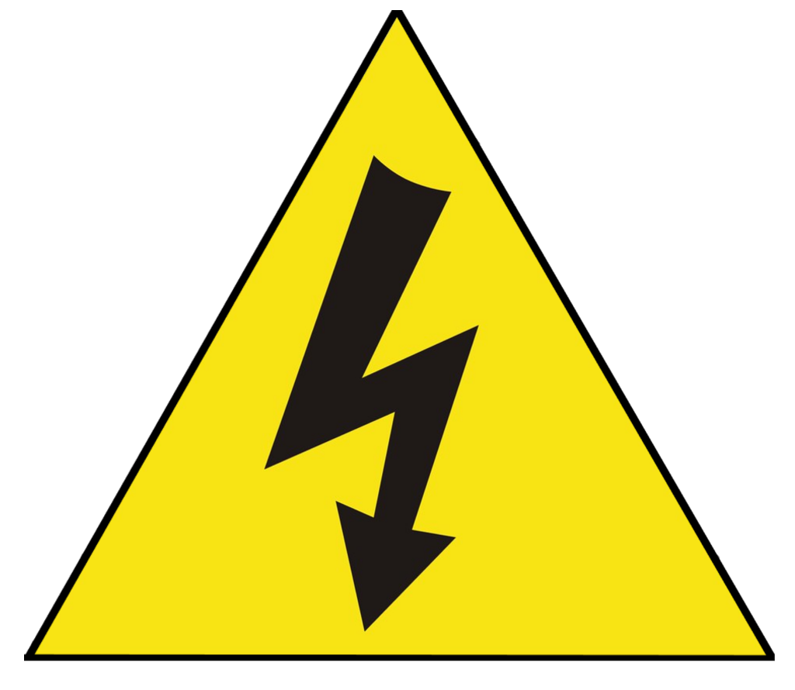

# Test equipment cabinet

  
### Author
Jorge Miguel González Novez  |  _Senior Technician in Electrotechnical and Automated Systems_

### Wiring diagrams  
- [Wiring](./documents/plano-electrico-v1.pdf)

### Materials  

TO-DO

### Operating Instructions  

TO-DO

### Liability

TO-DO

