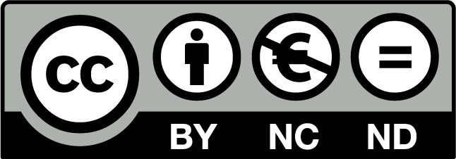

```diff
Last wiring diagrams: July 4, 2022
```
# License



- [More info about CC license](./images/cc-license.png)

# Test equipment enclosure
  
### Author
Jorge Miguel González Novez  |  _Technician in Electrotechnical and Automated Systems_

### Wiring diagrams and images  
- [Wiring](./docs/final-wiring.pdf)  
- [Images](./images)

### Materials  

- [Materials](./docs/materials.md)

### Operating Instructions  

- [Operating instructions](./docs/operating-instructions.md)

### Liability

**I am not responsible for the inappropriate use of the information shown here.  
As well as for any accident caused by the incorrect use of the materials and/or tools.  
Electricity is not a game.  
Always follow the 5 golden rules.**


  
### Software licenses

 

<https://www.eplaneducation.es/es/download-eplan-education/eplan-education>  
