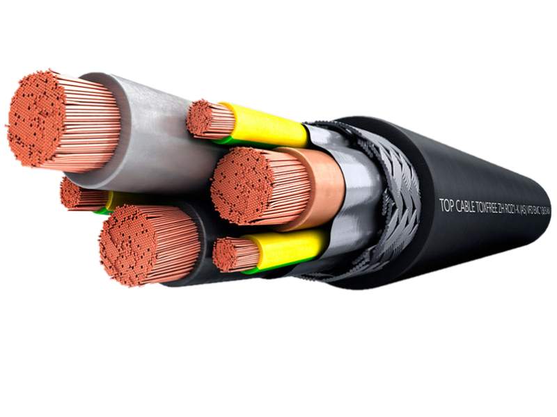
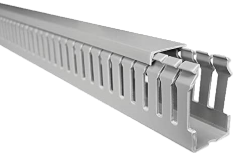
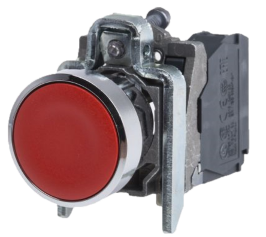
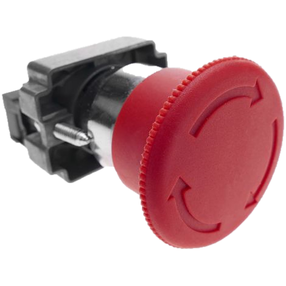
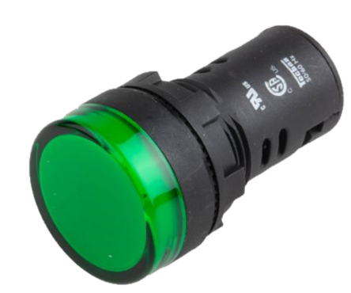

# Materials

- 1 x Enclosure 300 x 400 mm  
    

- Wire:  
    
    - 1 x 5m 4mm2 black phase wire  
    - 1 x 5m 4mm2 blue neutral wire  
    - 1 x 5m 4mm2 green-yellow protection wire  
    - 1 x 5m 1,5mm2 black phase wire  
    - 1 x 5m 1,5mm2 blue neutral wire  
    - 1 x 5m 1,5mm2 green-yellow protection wire
    - 1 x 5m 1,5mm2 black negative wire  
    - 1 x 5m 1,5mm2 red positive wire  
    
- Wire insulated ferrules:  
    
    - 1 x 50 4mm2  
    - 1 x 50 4mm2 twin  
    - 1 x 50 1,5mm2  
    - 1 x 50 1,5mm2 twin  
    - 1 x 50 2,5mm2  
        
- 1 x 2m Grooved gutter 40 x 30 mm  
    
  
- 1 x 1m DIN rail 35mm  
    
  
- 1 x IEC C14 connector  
   
  
- 1 x MCB Magnetotermic bipolar circuit breaker C20A  
    
  
- 2 x MCB Magnetotermic bipolar circuit breaker C10A  
    
  
- 1 x Green push button 1NO  
    
  
- 1 x Red push button 1NC  
    
  
- 1 x Emergency stop 1NC  
    
  
- 1 x Transformer  
    
  
- 5 x Cable gland Ø16mm  
  

- Lamps:  
    
    - 1 x 230VaC Green Ø22mm  | to indicate proper operation   
    - 2 x 30VdC Green Ø22mm   | to indicate the chosen voltage   
    - 1 x 230VaC Red Ø22mm    | to indicate overload failure 
    - 1 x 230VaC Blue Ø22mm   | to indicate that the door is open 
    - 1 x 230VaC Yellow Ø22mm | to indicate that exit is energized  
    
- 1 x Labeller  

